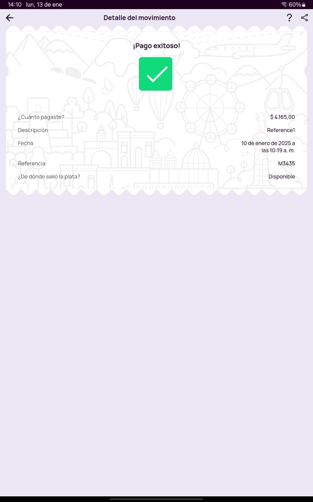

# Documentación Nequi

Documentación de la integración de Fleteo con Nequi para pagos en línea.

---

## Índice

1. [Solicitud para obtener Token de Nequi](#1-solicitud-para-obtener-token-de-nequi)
2. [Pagos exitosos](#2-pagos-exitosos)
3. [Pagos rechazados](#3-pagos-rechazados-desde-la-app)
4. [Pagos expirados](#4-pagos-expirados)
5. [Pagos con numeros no vinculados](#5-pagos-con-número-que-no-tiene-cuenta-nequi)
6. [Servicio de reverso](#6-uso-del-servicio-de-reverso-de-pagos)

---

## 1. Solicitud para obtener Token de Nequi

  ### URL

  `https://oauth.sandbox.nequi.com/oauth2/token?grant_type=client_credentials`

  ### Cuerpo de la solicitud

  ```json
  {
    "access_token": "eyJraWQiOiJuZVhiaFBIVkREV3IxXC9sZTl2YVdVQ0laNHlrSHZsUkF0bjFGajBRSVU3WT0iLCJhbGciOiJSUzI1NiJ9..."
  }
  ```

  ### Respuesta obtenida

- **Acess Token**: (*token*)

---

## 2. Pagos exitosos

- ### **Solicitud de notificación push**

  ### URL

  `https://api.sandbox.nequi.com/payments/v2/-services-paymentservice-unregisteredpayment`

  ### Cuerpo de la solicitud

  ```json
  {
    "RequestMessage": {
      "RequestHeader": {
        "Channel": "PNP04-C001",
        "RequestDate": "2025-01-10T15:17:38Z",
        "MessageID": "29e9f412-7ae8-4377-8052-ef220ff98e38",
        "ClientID": "12345",
        "Destination": {
          "ServiceName": "PaymentsService",
          "ServiceOperation": "unregisteredPayment",
          "ServiceRegion": "C001",
          "ServiceVersion": "1.0.0"
        }
      },
      "RequestBody": {
        "any": {
          "unregisteredPaymentRQ": {
            "phoneNumber": "3560567253",
            "code": "NIT_1",
            "value": "4165",
            "reference1": "reference1",
            "reference2": "reference2",
            "reference3": "reference3"
          }
        }
      }
    }
  }
  ```

  ### Respuesta obtenida

  - **Cuerpo de la respuesta**:

    ```json
    {
      "ResponseMessage": {
        "ResponseHeader": {
          "Channel": "PNP04-C001",
          "ResponseDate": "2025-01-10T15:17:49.747Z",
          "Status": {
            "StatusCode": "0",
            "StatusDesc": "SUCCESS"
          },
          "MessageID": "29e9f412-7ae8-4377-8052-ef220ff98e38",
          "ClientID": "12345",
          "Destination": {
            "ServiceName": "PaymentsService",
            "ServiceOperation": "unregisteredPayment",
            "ServiceRegion": "C001",
            "ServiceVersion": "1.0.0"
          }
        },
        "ResponseBody": {
          "any": {
            "unregisteredPaymentRS": {
              "transactionId": "350-12345-36517011-29e9f412-7ae8-4377-8052-ef220ff"
            }
          }
        }
      }
    }
    ```

  - **ID de Transacción**: `350-12345-36517011-29e9f412-7ae8-4377-8052-ef220ff`
  
- ### **Consultando Estado del Pago**

  ### URL

  `https://api.sandbox.nequi.com/payments/v2/-services-paymentservice-getstatuspayment`

  ### Cuerpo de la solicitud

  ```json
  {
    "RequestMessage": {
      "RequestHeader": {
        "Channel": "PNP04-C001",
        "RequestDate": "2025-01-10T15:20:52Z",
        "MessageID": "e6935dd7-2624-4f4e-82da-4d5afc9a7066",
        "ClientID": "12345",
        "Destination": {
          "ServiceName": "PaymentsService",
          "ServiceOperation": "getStatusPayment",
          "ServiceRegion": "C001",
          "ServiceVersion": "1.0.0"
        }
      },
      "RequestBody": {
        "any": {
          "getStatusPaymentRQ": {
            "codeQR": "350-12345-36517011-29e9f412-7ae8-4377-8052-ef220ff"
          }
        }
      }
    }
  }
  ```

  ### Respuesta obtenida

  - **Cuerpo de la respueta**:

    ```json
    {
      "ResponseMessage": {
        "ResponseHeader": {
          "Channel": "PNP04-C001",
          "ResponseDate": "2025-01-10T15:20:56.961Z",
          "Status": {
            "StatusCode": "0",
            "StatusDesc": "SUCCESS"
          },
          "MessageID": "e6935dd7-2624-4f4e-82da-4d5afc9a7066",
          "ClientID": "12345",
          "Destination": {
            "ServiceName": "PaymentsService",
            "ServiceOperation": "getStatusPayment",
            "ServiceRegion": "C001",
            "ServiceVersion": "1.0.0"
          }
        },
        "ResponseBody": {
          "any": {
            "getStatusPaymentRS": {
              "date": "2025-01-10 10:17:41",
              "trnId": "12345",
              "phoneNumber": "3560567253",
              "originMoney": [{}],
              "name": "EL RANCHERO1",
              "ipAddress": "N/A",
              "value": "4165",
              "status": "35"
            }
          }
        }
      }
    }
    ```

  - **Estado del Pago**: `35`

  - **Comprobante**:
    

---

## 3. Pagos rechazados desde la app

- ### **Solicitud de notificación push**

  ### URL

  `https://api.sandbox.nequi.com/payments/v2/-services-paymentservice-unregisteredpayment`

  ### Cuerpo de la solicitud

  ```json
  {
    "RequestMessage": {
      "RequestHeader": {
        "Channel": "PNP04-C001",
        "RequestDate": "2025-01-10T19:16:09Z",
        "MessageID": "37d53ecf-9f26-4552-b224-9ff36c1faefa",
        "ClientID": "12345",
        "Destination": {
          "ServiceName": "PaymentsService",
          "ServiceOperation": "unregisteredPayment",
          "ServiceRegion": "C001",
          "ServiceVersion": "1.0.0"
        }
      },
      "RequestBody": {
        "any": {
          "unregisteredPaymentRQ": {
            "phoneNumber": "3560567253",
            "code": "NIT_1",
            "value": "4165",
            "reference1": "reference1",
            "reference2": "reference2",
            "reference3": "reference3"
          }
        }
      }
    }
  }
  ```

  ### Respuesta obtenida

  - **Cuerpo de la respuesta**:

    ```json
    {
     "ResponseMessage": {
       "ResponseHeader": {
         "Channel": "PNP04-C001",
         "ResponseDate": "2025-01-10T19:16:21.266Z",
         "Status": {
           "StatusCode": "0",
           "StatusDesc": "SUCCESS"
         },
         "MessageID": "37d53ecf-9f26-4552-b224-9ff36c1faefa",
         "ClientID": "12345",
         "Destination": {
           "ServiceName": "PaymentsService",
           "ServiceOperation": "unregisteredPayment",
           "ServiceRegion": "C001",
           "ServiceVersion": "1.0.0"
         }
       },
       "ResponseBody": {
         "any": {
           "unregisteredPaymentRS": {
             "transactionId": "350-12345-36517011-37d53ecf-9f26-4552-b224-9ff36c1"
           }
         }
       }
      }
    }
    ```

  - **ID de Transacción**: `350-12345-36517011-37d53ecf-9f26-4552-b224-9ff36c1`

- ### **Consultando Estado del Pago**

  ### URL

  `https://api.sandbox.nequi.com/payments/v2/-services-paymentservice-getstatuspayment`

  ### Cuerpo de la solicitud

  ```json
  {
    "RequestMessage":{
      "RequestHeader":{
        "Channel":"PNP04-C001",
        "RequestDate":"2025-01-10T19:19:23Z",
        "MessageID":"8ae67293-602d-4cf7-9e7b-bd2fee35060c",
        "ClientID":"12345",
        "Destination":{
          "ServiceName":"PaymentsService",
          "ServiceOperation":"getStatusPayment",
          "ServiceRegion":"C001",
          "ServiceVersion":"1.0.0"
        }
      },
      "RequestBody":{
        "any":{
          "getStatusPaymentRQ":{
            "codeQR":"350-12345-36517011-37d53ecf-9f26-4552-b224-9ff36c1"
          }
        }
      }
    }
  }
  ```

  ### Respuesta obtenida

  - **Cuerpo de la respueta**:

    ```json
    {
      "ResponseMessage":{
        "ResponseHeader":{
          "Channel":"PNP04-C001",
          "ResponseDate":"2025-01-10T19:19:24.101Z",
          "Status":{
            "StatusCode":"10-455",
            "StatusDesc":"La transacción esta cancelada"
          },
          "MessageID":"8ae67293-602d-4cf7-9e7b-bd2fee35060c",
          "ClientID":"12345",
          "Destination":{
            "ServiceName":"PaymentsService",
            "ServiceOperation":"getStatusPayment",
            "ServiceRegion":"C001",
            "ServiceVersion":"1.0.0"
          }
        },
        "ResponseBody":{
          "any":{

          }
        }
      }
    }
    ```

  - **Estado del Pago**: `10-455`

---

## 4. Pagos expirados

> **Nota:** En este caso, verificamos el estado de la transacción a los 3 minutos. Si el usuario no ha aceptado ni cancelado la notificación, el sistema cancela automáticamente la notificación y el pago.

- ### **Solicitud de notificación push**

  ### URL

  `https://api.sandbox.nequi.com/payments/v2/-services-paymentservice-unregisteredpayment`

  ### Cuerpo de la solicitud

  ```json
  {
    "RequestMessage":{
      "RequestHeader":{
        "Channel":"PNP04-C001",
        "RequestDate":"2025-01-13T16:45:55Z",
        "MessageID":"44029156-fa67-4f6d-8060-f14905293e28",
        "ClientID":"12345",
        "Destination":{
          "ServiceName":"PaymentsService",
          "ServiceOperation":"unregisteredPayment",
          "ServiceRegion":"C001",
          "ServiceVersion":"1.0.0"
        }
      },
      "RequestBody":{
        "any":{
          "unregisteredPaymentRQ":{
            "phoneNumber":"3560567253",
            "code":"NIT_1",
            "value":"4165",
            "reference1":"reference1",
            "reference2":"reference2",
            "reference3":"reference3"
          }
        }
      }
    }
  }
  ```

  ### Respuesta obtenida

  - **Cuerpo de la respuesta**:

    ```json
    {
      "ResponseMessage":{
        "ResponseHeader":{
          "Channel":"PNP04-C001",
          "ResponseDate":"2025-01-13T16:46:08.157Z",
          "Status":{
            "StatusCode":"0",
            "StatusDesc":"SUCCESS"
          },
          "MessageID":"44029156-fa67-4f6d-8060-f14905293e28",
          "ClientID":"12345",
          "Destination":{
            "ServiceName":"PaymentsService",
            "ServiceOperation":"unregisteredPayment",
            "ServiceRegion":"C001",
            "ServiceVersion":"1.0.0"
          }
        },
        "ResponseBody":{
          "any":{
            "unregisteredPaymentRS":{
              "transactionId":"350-12345-36517011-44029156-fa67-4f6d-8060-f149052"
            }
          }
        }
      }
    }
    ```

  - **ID de Transacción**: `350-12345-36517011-44029156-fa67-4f6d-8060-f149052`

- ### **Consultando Estado del Pago**

  ### URL

  `https://api.sandbox.nequi.com/payments/v2/-services-paymentservice-getstatuspayment`

  ### Cuerpo de la solicitud

  ```json
  {
    "RequestMessage":{
      "RequestHeader":{
        "Channel":"PNP04-C001",
        "RequestDate":"2025-01-13T16:49:10Z",
        "MessageID":"f4ea3b3c-2606-4f09-b685-bf31093a35f4",
        "ClientID":"12345",
        "Destination":{
          "ServiceName":"PaymentsService",
          "ServiceOperation":"getStatusPayment",
          "ServiceRegion":"C001",
          "ServiceVersion":"1.0.0"
        }
      },
      "RequestBody":{
        "any":{
          "getStatusPaymentRQ":{
            "codeQR":"350-12345-36517011-44029156-fa67-4f6d-8060-f149052"
          }
        }
      }
    }
  }
  ```

  ### Respuesta obtenida

  - **Cuerpo de la respueta**:

    ```json
    {
      "ResponseMessage":{
        "ResponseHeader":{
          "Channel":"PNP04-C001",
          "ResponseDate":"2025-01-13T16:49:15.631Z",
          "Status":{
            "StatusCode":"0",
            "StatusDesc":"SUCCESS"
          },
          "MessageID":"f4ea3b3c-2606-4f09-b685-bf31093a35f4",
          "ClientID":"12345",
          "Destination":{
            "ServiceName":"PaymentsService",
            "ServiceOperation":"getStatusPayment",
            "ServiceRegion":"C001",
            "ServiceVersion":"1.0.0"
          }
        },
        "ResponseBody":{
          "any":{
            "getStatusPaymentRS":{
              "date":"Enero 13 - 2025 | 11:45 AM",
              "trnId":"350-12345-36517011-44029156-fa67-4f6d-8060-f149052",
              "originMoney":[

              ],
              "name":"EL RANCHERO1",
              "ipAddress":"N/A",
              "value":"4165",
              "status":"33"
            }
          }
        }
      }
    }
    ```

  - **Estado del Pago**: `33`

- ### **Cancelar pago pendiente**
  
  ### URL

  `https://api.sandbox.nequi.com/payments/v2/-services-paymentservice-cancelunregisteredpayment`

  ### Cuerpo de la solicitud

  ```json
  {
    "RequestMessage":{
      "RequestHeader":{
        "Channel":"PNP04-C001",
        "RequestDate":"2025-01-13T16:49:18Z",
        "MessageID":"93237e10-e935-4129-b7cb-d3b64b94ad38",
        "ClientID":"12345",
        "Destination":{
          "ServiceName":"PaymentsService",
          "ServiceOperation":"unregisteredPayment",
          "ServiceRegion":"C001",
          "ServiceVersion":"1.0.0"
        }
      },
      "RequestBody":{
        "any":{
          "cancelUnregisteredPaymentRQ":{
            "code":"NIT_1",
            "phoneNumber":"3560567253",
            "transactionId":"350-12345-36517011-44029156-fa67-4f6d-8060-f149052"
          }
        }
      }
    }
  }
  ```

  ### Respuesta obtenida

  ```json
  {
    "ResponseMessage":{
      "ResponseHeader":{
        "Channel":"PNP04-C001",
        "ResponseDate":"2025-01-13T16:49:27.538Z",
        "Status":{
          "StatusCode":"0",
          "StatusDesc":"SUCCESS"
        },
        "MessageID":"93237e10-e935-4129-b7cb-d3b64b94ad38",
        "ClientID":"12345",
        "Destination":{
          "ServiceName":"PaymentsService",
          "ServiceOperation":"unregisteredPayment",
          "ServiceRegion":"C001",
          "ServiceVersion":"1.0.0"
        }
      },
      "ResponseBody":{
        "any":{
          "cancelRequestMoneyRS":{

          }
        }
      }
    }
  }
  ```

---

## 5. Pagos con número que no tiene cuenta Nequi

- ### **Solicitud de notificación push**

  ### URL

  `https://api.sandbox.nequi.com/payments/v2/-services-paymentservice-unregisteredpayment`

  ### Cuerpo de la solicitud

  ```json
  {
    "RequestMessage":{
      "RequestHeader":{
        "Channel":"PNP04-C001",
        "RequestDate":"2025-01-13T16:02:40Z",
        "MessageID":"47136e5a-3ee9-4a4b-8046-5a6e2c748b7c",
        "ClientID":"12345",
        "Destination":{
          "ServiceName":"PaymentsService",
          "ServiceOperation":"unregisteredPayment",
          "ServiceRegion":"C001",
          "ServiceVersion":"1.0.0"
        }
      },
      "RequestBody":{
        "any":{
          "unregisteredPaymentRQ":{
            "phoneNumber":"3222222222",
            "code":"NIT_1",
            "value":"4165",
            "reference1":"reference1",
            "reference2":"reference2",
            "reference3":"reference3"
          }
        }
      }
    }
  }
  ```

  ### Respuesta obtenida

  - **Cuerpo de la respuesta**:

    ```json
    {
      "ResponseMessage":{
        "ResponseHeader":{
          "Channel":"PNP04-C001",
          "ResponseDate":"2025-01-13T16:02:47.259Z",
          "Status":{
            "StatusCode":"20-08A",
            "StatusDesc":"Ese cliente no existe"
          },
          "MessageID":"47136e5a-3ee9-4a4b-8046-5a6e2c748b7c",
          "ClientID":"12345",
          "Destination":{
            "ServiceName":"PaymentsService",
            "ServiceOperation":"unregisteredPayment",
            "ServiceRegion":"C001",
            "ServiceVersion":"1.0.0"
          }
        },
        "ResponseBody":{
          "any":{

          }
        }
      }
    }
    ```

  - **ID de Transacción**: `no registra`

---

## 6. Uso del servicio de reverso de pagos

- ### **Solicitud de notificación push**

  ### URL

  `https://api.sandbox.nequi.com/payments/v2/-services-paymentservice-unregisteredpayment`

  ### Cuerpo de la solicitud

  ```json
  {
    "RequestMessage":{
      "RequestHeader":{
        "Channel":"PNP04-C001",
        "RequestDate":"2025-01-13T18:43:54Z",
        "MessageID":"aec4380d-42c2-4044-87dc-1bbb66c05b5a",
        "ClientID":"12345",
        "Destination":{
          "ServiceName":"PaymentsService",
          "ServiceOperation":"unregisteredPayment",
          "ServiceRegion":"C001",
          "ServiceVersion":"1.0.0"
        }
      },
      "RequestBody":{
        "any":{
          "unregisteredPaymentRQ":{
            "phoneNumber":"3560567253",
            "code":"NIT_1",
            "value":"4760",
            "reference1":"reference1",
            "reference2":"reference2",
            "reference3":"reference3"
          }
        }
      }
    }
  }
  ```

  ### Respuesta obtenida

  - **Cuerpo de la respuesta**:

    ```json
    {
      "ResponseMessage":{
        "ResponseHeader":{
          "Channel":"PNP04-C001",
          "ResponseDate":"2025-01-13T18:44:06.055Z",
          "Status":{
            "StatusCode":"0",
            "StatusDesc":"SUCCESS"
          },
          "MessageID":"aec4380d-42c2-4044-87dc-1bbb66c05b5a",
          "ClientID":"12345",
          "Destination":{
            "ServiceName":"PaymentsService",
            "ServiceOperation":"unregisteredPayment",
            "ServiceRegion":"C001",
            "ServiceVersion":"1.0.0"
          }
        },
        "ResponseBody":{
          "any":{
            "unregisteredPaymentRS":{
              "transactionId":"350-12345-36517011-aec4380d-42c2-4044-87dc-1bbb66c"
            }
          }
        }
      }
    }
    ```

  - **ID de Transacción**: `350-12345-36517011-aec4380d-42c2-4044-87dc-1bbb66c`

- ### **Consultando Estado del Pago**

  ### URL

  `https://api.sandbox.nequi.com/payments/v2/-services-paymentservice-getstatuspayment`

  ### Cuerpo de la solicitud

  ```json
  {
    "RequestMessage":{
      "RequestHeader":{
        "Channel":"PNP04-C001",
        "RequestDate":"2025-01-13T18:47:08Z",
        "MessageID":"20803d96-e58c-4371-b9b3-4a2765e62767",
        "ClientID":"12345",
        "Destination":{
          "ServiceName":"PaymentsService",
          "ServiceOperation":"getStatusPayment",
          "ServiceRegion":"C001",
          "ServiceVersion":"1.0.0"
        }
      },
      "RequestBody":{
        "any":{
          "getStatusPaymentRQ":{
            "codeQR":"350-12345-36517011-aec4380d-42c2-4044-87dc-1bbb66c"
          }
        }
      }
    }
  }
  ```

  ### Respuesta obtenida

  - **Cuerpo de la respueta**:

    ```plaintext
      Net::ReadTimeout with #<TCPSocket:(closed)>
    ```

  - **Estado del Pago**: `nil`

    > **Nota:** Esta respuesta indica que no se pudo obtener el estado del pago debido a un tiempo de espera agotado durante la consulta. Esto puede ocurrir por problemas de conectividad o por una respuesta tardía del servicio externo.

- ### **Reversar pago**
  
  ### URL

  `https://api.sandbox.nequi.com/-services-reverseservices-reversetransaction`

  ### Cuerpo de la solicitud

  ```json
  {
    "RequestMessage":{
      "RequestHeader":{
        "Channel":"PNP04-C001",
        "RequestDate":"2025-01-13T18:47:11Z",
        "MessageID":"46f8e65a-cbbf-44f9-9d2d-06cad1e14dc9",
        "ClientID":"12345",
        "Destination":{
          "ServiceName":"ReverseServices",
          "ServiceOperation":"reverseTransaction",
          "ServiceRegion":"C001",
          "ServiceVersion":"1.0.0"
        }
      },
      "RequestBody":{
        "any":{
          "reversionRQ":{
            "phoneNumber":"3560567253",
            "value":"4000",
            "code":"NIT_1",
            "messageId":"aec4380d-42c2-4044-87dc-1bbb66c05b5a",
            "type":"payment"
          }
        }
      }
    }
  }
  ```

  ### Respuesta obtenida

  ```json
  {
    "message": "Forbidden",
    "headers": {
      "content-type": ["application/json"],
      "content-length": ["24"],
      "connection": ["close"],
      "date": ["Mon, 13 Jan 2025 18:47:11 GMT"],
      "x-amz-apigw-id": ["EVvjgETGoAMEdAQ="],
      "x-amzn-requestid": ["0c557778-6f5b-461a-8c2f-0d53c8b2c00d"],
      "x-amzn-errortype": ["ForbiddenException"],
      "x-cache": ["Error from cloudfront"],
      "via": ["1.1 8aaf07807b640d113c47df1d50eca064.cloudfront.net (CloudFront)"],
      "x-amz-cf-pop": ["IAD89-P2"],
      "x-amz-cf-id": ["ax9FEHeq2lJMDqM09b7Lu5oKwIGdkzGmsJxm_xJyiAvf5Cj2NkefGA=="]
    }
  }
  ```

---
