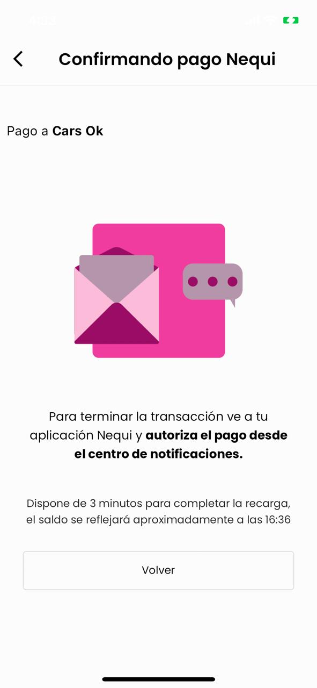

# Documentación Nequi

Documentación de la integración de Fleteo con Nequi para pagos en línea.

---

## Índice

1. [Solicitud para obtener Token de Nequi](#1-solicitud-para-obtener-token-de-nequi)
2. [Pagos exitosos](#2-pagos-exitosos)
3. [Pagos rechazados](#3-pagos-rechazados-desde-la-app)
4. [Pagos expirados](#4-pagos-expirados)
5. [Pagos con numeros no vinculados](#5-pagos-con-número-que-no-tiene-cuenta-nequi)
6. [Servicio de reverso](#6-uso-del-servicio-de-reverso-de-pagos)
7. [Experiencia de usuario](#7-experiencia-de-usuario)

---

## 1. Solicitud para obtener Token de Nequi

  ### URL

  `https://oauth.sandbox.nequi.com/oauth2/token?grant_type=client_credentials`

  ### Cuerpo de la solicitud

  ```json
  {
    "access_token": "eyJraWQiOiJuZVhiaFBIVkREV3IxXC9sZTl2YVdVQ0laNHlrSHZsUkF0bjFGajBRSVU3WT0iLCJhbGciOiJSUzI1NiJ9..."
  }
  ```

  ### Respuesta obtenida

- **Acess Token**: (*token*)

---

## 2. Pagos exitosos

- ### **Solicitud de notificación push**

  ### URL

  `https://api.sandbox.nequi.com/payments/v2/-services-paymentservice-unregisteredpayment`

  ### Cuerpo de la solicitud

  ```json
  {
    "RequestMessage":{
      "RequestHeader":{
        "Channel":"PNP04-C001",
        "RequestDate":"2025-01-17T21:12:54Z",
        "MessageID":"MqYjk3O2UP",
        "ClientID":"12345",
        "Destination":{
          "ServiceName":"PaymentsService",
          "ServiceOperation":"unregisteredPayment",
          "ServiceRegion":"C001",
          "ServiceVersion":"1.0.0"
        }
      },
      "RequestBody":{
        "any":{
          "unregisteredPaymentRQ":{
            "phoneNumber":"3560567253",
            "code":"NIT_1",
            "value":"5950",
            "reference1":"reference1",
            "reference2":"reference2",
            "reference3":"reference3"
          }
        }
      }
    }
  }
  ```

  ### Respuesta obtenida

  - **Cuerpo de la respuesta**:

    ```json
    {
      "ResponseMessage":{
        "ResponseHeader":{
          "Channel":"PNP04-C001",
          "ResponseDate":"2025-01-17T21:13:05.522Z",
          "Status":{
            "StatusCode":"0",
            "StatusDesc":"SUCCESS"
          },
          "MessageID":"MqYjk3O2UP",
          "ClientID":"12345",
          "Destination":{
            "ServiceName":"PaymentsService",
            "ServiceOperation":"unregisteredPayment",
            "ServiceRegion":"C001",
            "ServiceVersion":"1.0.0"
          }
        },
        "ResponseBody":{
          "any":{
            "unregisteredPaymentRS":{
              "transactionId":"350-12345-36517011-MqYjk3O2UP"
            }
          }
        }
      }
    }
    ```

  - **ID de Transacción**: `350-12345-36517011-MqYjk3O2UP`
  
- ### **Consultando Estado del Pago**

  ### URL

  `https://api.sandbox.nequi.com/payments/v2/-services-paymentservice-getstatuspayment`

  ### Cuerpo de la solicitud

  ```json
  {
    "RequestMessage":{
      "RequestHeader":{
        "Channel":"PNP04-C001",
        "RequestDate":"2025-01-17T21:16:07Z",
        "MessageID":"vFjkFY7s4Z",
        "ClientID":"12345",
        "Destination":{
          "ServiceName":"PaymentsService",
          "ServiceOperation":"getStatusPayment",
          "ServiceRegion":"C001",
          "ServiceVersion":"1.0.0"
        }
      },
      "RequestBody":{
        "any":{
          "getStatusPaymentRQ":{
            "codeQR":"350-12345-36517011-MqYjk3O2UP"
          }
        }
      }
    }
  }
  ```

  ### Respuesta obtenida

  - **Cuerpo de la respueta**:

    ```json
    {
      "ResponseMessage":{
        "ResponseHeader":{
          "Channel":"PNP04-C001",
          "ResponseDate":"2025-01-17T21:16:12.647Z",
          "Status":{
            "StatusCode":"0",
            "StatusDesc":"SUCCESS"
          },
          "MessageID":"vFjkFY7s4Z",
          "ClientID":"12345",
          "Destination":{
            "ServiceName":"PaymentsService",
            "ServiceOperation":"getStatusPayment",
            "ServiceRegion":"C001",
            "ServiceVersion":"1.0.0"
          }
        },
        "ResponseBody":{
          "any":{
            "getStatusPaymentRS":{
              "date":"2025-01-17 16:12:57",
              "trnId":"12345",
              "phoneNumber":"3560567253",
              "originMoney":[
                {
                  
                }
              ],
              "name":"EL RANCHERO1",
              "ipAddress":"N/A",
              "value":"5950",
              "status":"35"
            }
          }
        }
      }
    }
    ```

  - **Estado del Pago**: `35`

  - **Comprobante**:
    

---

## 3. Pagos rechazados desde la app

- ### **Solicitud de notificación push**

  ### URL

  `https://api.sandbox.nequi.com/payments/v2/-services-paymentservice-unregisteredpayment`

  ### Cuerpo de la solicitud

  ```json
  {
    "RequestMessage":{
      "RequestHeader":{
        "Channel":"PNP04-C001",
        "RequestDate":"2025-01-20T14:24:50Z",
        "MessageID":"KDcyo8JTLc",
        "ClientID":"12345",
        "Destination":{
          "ServiceName":"PaymentsService",
          "ServiceOperation":"unregisteredPayment",
          "ServiceRegion":"C001",
          "ServiceVersion":"1.0.0"
        }
      },
      "RequestBody":{
        "any":{
          "unregisteredPaymentRQ":{
            "phoneNumber":"3560567253",
            "code":"NIT_1",
            "value":"5950",
            "reference1":"reference1",
            "reference2":"reference2",
            "reference3":"reference3"
          }
        }
      }
    }
  }
  ```

  ### Respuesta obtenida

  - **Cuerpo de la respuesta**:

    ```json
    {
      "ResponseMessage":{
        "ResponseHeader":{
          "Channel":"PNP04-C001",
          "ResponseDate":"2025-01-20T14:25:02.997Z",
          "Status":{
            "StatusCode":"0",
            "StatusDesc":"SUCCESS"
          },
          "MessageID":"KDcyo8JTLc",
          "ClientID":"12345",
          "Destination":{
            "ServiceName":"PaymentsService",
            "ServiceOperation":"unregisteredPayment",
            "ServiceRegion":"C001",
            "ServiceVersion":"1.0.0"
          }
        },
        "ResponseBody":{
          "any":{
            "unregisteredPaymentRS":{
              "transactionId":"350-12345-36517011-KDcyo8JTLc"
            }
          }
        }
      }
    }
    ```

  - **ID de Transacción**: `350-12345-36517011-KDcyo8JTLc`

- ### **Consultando Estado del Pago**

  ### URL

  `https://api.sandbox.nequi.com/payments/v2/-services-paymentservice-getstatuspayment`

  ### Cuerpo de la solicitud

  ```json
  {
    "RequestMessage":{
      "RequestHeader":{
        "Channel":"PNP04-C001",
        "RequestDate":"2025-01-20T14:28:05Z",
        "MessageID":"P2ZWAuzMAf",
        "ClientID":"12345",
        "Destination":{
          "ServiceName":"PaymentsService",
          "ServiceOperation":"getStatusPayment",
          "ServiceRegion":"C001",
          "ServiceVersion":"1.0.0"
        }
      },
      "RequestBody":{
        "any":{
          "getStatusPaymentRQ":{
            "codeQR":"350-12345-36517011-KDcyo8JTLc"
          }
        }
      }
    }
  }
  ```

  ### Respuesta obtenida

  - **Cuerpo de la respueta**:

    ```json
    {
      "ResponseMessage":{
        "ResponseHeader":{
          "Channel":"PNP04-C001",
          "ResponseDate":"2025-01-20T14:28:10.267Z",
          "Status":{
            "StatusCode":"10-455",
            "StatusDesc":"La transacción esta cancelada"
          },
          "MessageID":"P2ZWAuzMAf",
          "ClientID":"12345",
          "Destination":{
            "ServiceName":"PaymentsService",
            "ServiceOperation":"getStatusPayment",
            "ServiceRegion":"C001",
            "ServiceVersion":"1.0.0"
          }
        },
        "ResponseBody":{
          "any":{

          }
        }
      }
    }
    ```

  - **Estado del Pago**: `10-455`

---

## 4. Pagos expirados

> **Nota:** En este caso, verificamos el estado de la transacción a los 3 minutos. Si el usuario no ha aceptado ni cancelado la notificación, el sistema cancela automáticamente la notificación y el pago.

- ### **Solicitud de notificación push**

  ### URL

  `https://api.sandbox.nequi.com/payments/v2/-services-paymentservice-unregisteredpayment`

  ### Cuerpo de la solicitud

  ```json
  {
    "RequestMessage":{
      "RequestHeader":{
        "Channel":"PNP04-C001",
        "RequestDate":"2025-01-20T14:36:16Z",
        "MessageID":"hDKdPl6lr3",
        "ClientID":"12345",
        "Destination":{
          "ServiceName":"PaymentsService",
          "ServiceOperation":"unregisteredPayment",
          "ServiceRegion":"C001",
          "ServiceVersion":"1.0.0"
        }
      },
      "RequestBody":{
        "any":{
          "unregisteredPaymentRQ":{
            "phoneNumber":"3560567253",
            "code":"NIT_1",
            "value":"5950",
            "reference1":"reference1",
            "reference2":"reference2",
            "reference3":"reference3"
          }
        }
      }
    }
  }
  ```

  ### Respuesta obtenida

  - **Cuerpo de la respuesta**:

    ```json
    {
      "ResponseMessage":{
        "ResponseHeader":{
          "Channel":"PNP04-C001",
          "ResponseDate":"2025-01-20T14:36:25.861Z",
          "Status":{
            "StatusCode":"0",
            "StatusDesc":"SUCCESS"
          },
          "MessageID":"hDKdPl6lr3",
          "ClientID":"12345",
          "Destination":{
            "ServiceName":"PaymentsService",
            "ServiceOperation":"unregisteredPayment",
            "ServiceRegion":"C001",
            "ServiceVersion":"1.0.0"
          }
        },
        "ResponseBody":{
          "any":{
            "unregisteredPaymentRS":{
              "transactionId":"350-12345-36517011-hDKdPl6lr3"
            }
          }
        }
      }
    }
    ```

  - **ID de Transacción**: `350-12345-36517011-hDKdPl6lr3`

- ### **Consultando Estado del Pago**

  ### URL

  `https://api.sandbox.nequi.com/payments/v2/-services-paymentservice-getstatuspayment`

  ### Cuerpo de la solicitud

  ```json
  {
    "RequestMessage":{
      "RequestHeader":{
        "Channel":"PNP04-C001",
        "RequestDate":"2025-01-20T14:39:28Z",
        "MessageID":"Ge2yZqpwtp",
        "ClientID":"12345",
        "Destination":{
          "ServiceName":"PaymentsService",
          "ServiceOperation":"getStatusPayment",
          "ServiceRegion":"C001",
          "ServiceVersion":"1.0.0"
        }
      },
      "RequestBody":{
        "any":{
          "getStatusPaymentRQ":{
            "codeQR":"350-12345-36517011-hDKdPl6lr3"
          }
        }
      }
    }
  }
  ```

  ### Respuesta obtenida

  - **Cuerpo de la respueta**:

    ```json
    {
      "ResponseMessage":{
        "ResponseHeader":{
          "Channel":"PNP04-C001",
          "ResponseDate":"2025-01-20T14:39:32.752Z",
          "Status":{
            "StatusCode":"0",
            "StatusDesc":"SUCCESS"
          },
          "MessageID":"Ge2yZqpwtp",
          "ClientID":"12345",
          "Destination":{
            "ServiceName":"PaymentsService",
            "ServiceOperation":"getStatusPayment",
            "ServiceRegion":"C001",
            "ServiceVersion":"1.0.0"
          }
        },
        "ResponseBody":{
          "any":{
            "getStatusPaymentRS":{
              "date":"Enero 20 - 2025 | 09:36 AM",
              "trnId":"350-12345-36517011-hDKdPl6lr3",
              "originMoney":[

              ],
              "name":"EL RANCHERO1",
              "ipAddress":"N/A",
              "value":"5950",
              "status":"33"
            }
          }
        }
      }
    }
    ```

  - **Estado del Pago**: `33`

- ### **Cancelar pago pendiente**
  
  ### URL

  `https://api.sandbox.nequi.com/payments/v2/-services-paymentservice-cancelunregisteredpayment`

  ### Cuerpo de la solicitud

  ```json
  {
    "RequestMessage":{
      "RequestHeader":{
        "Channel":"PNP04-C001",
        "RequestDate":"2025-01-20T14:39:34Z",
        "MessageID":"fyTsYY65zK",
        "ClientID":"12345",
        "Destination":{
          "ServiceName":"PaymentsService",
          "ServiceOperation":"unregisteredPayment",
          "ServiceRegion":"C001",
          "ServiceVersion":"1.0.0"
        }
      },
      "RequestBody":{
        "any":{
          "cancelUnregisteredPaymentRQ":{
            "code":"NIT_1",
            "phoneNumber":"3560567253",
            "transactionId":"350-12345-36517011-hDKdPl6lr3"
          }
        }
      }
    }
  }
  ```

  ### Respuesta obtenida

  ```json
  {
    "ResponseMessage":{
      "ResponseHeader":{
        "Channel":"PNP04-C001",
        "ResponseDate":"2025-01-20T14:39:41.899Z",
        "Status":{
          "StatusCode":"0",
          "StatusDesc":"SUCCESS"
        },
        "MessageID":"fyTsYY65zK",
        "ClientID":"12345",
        "Destination":{
          "ServiceName":"PaymentsService",
          "ServiceOperation":"unregisteredPayment",
          "ServiceRegion":"C001",
          "ServiceVersion":"1.0.0"
        }
      },
      "ResponseBody":{
        "any":{
          "cancelRequestMoneyRS":{
            
          }
        }
      }
    }
  }
  ```

---

## 5. Pagos con número que no tiene cuenta Nequi

- ### **Solicitud de notificación push**

  ### URL

  `https://api.sandbox.nequi.com/payments/v2/-services-paymentservice-unregisteredpayment`

  ### Cuerpo de la solicitud

  ```json
  {
    "RequestMessage":{
      "RequestHeader":{
        "Channel":"PNP04-C001",
        "RequestDate":"2025-01-20T14:46:36Z",
        "MessageID":"5PQEcaSRHj",
        "ClientID":"12345",
        "Destination":{
          "ServiceName":"PaymentsService",
          "ServiceOperation":"unregisteredPayment",
          "ServiceRegion":"C001",
          "ServiceVersion":"1.0.0"
        }
      },
      "RequestBody":{
        "any":{
          "unregisteredPaymentRQ":{
            "phoneNumber":"3222222222",
            "code":"NIT_1",
            "value":"5950",
            "reference1":"reference1",
            "reference2":"reference2",
            "reference3":"reference3"
          }
        }
      }
    }
  }
  ```

  ### Respuesta obtenida

  - **Cuerpo de la respuesta**:

    ```json
    {
      "ResponseMessage":{
        "ResponseHeader":{
          "Channel":"PNP04-C001",
          "ResponseDate":"2025-01-20T14:46:42.299Z",
          "Status":{
            "StatusCode":"20-08A",
            "StatusDesc":"Ese cliente no existe"
          },
          "MessageID":"5PQEcaSRHj",
          "ClientID":"12345",
          "Destination":{
            "ServiceName":"PaymentsService",
            "ServiceOperation":"unregisteredPayment",
            "ServiceRegion":"C001",
            "ServiceVersion":"1.0.0"
          }
        },
        "ResponseBody":{
          "any":{

          }
        }
      }
    }
    ```

  - **ID de Transacción**: `no registra`

---

## 6. Uso del servicio de reverso de pagos

- ### **Solicitud de notificación push**

  ### URL

  `https://api.sandbox.nequi.com/payments/v2/-services-paymentservice-unregisteredpayment`

  ### Cuerpo de la solicitud

  ```json
  {
    "RequestMessage":{
      "RequestHeader":{
        "Channel":"PNP04-C001",
        "RequestDate":"2025-01-20T15:27:12Z",
        "MessageID":"eC6gb3UGmT",
        "ClientID":"12345",
        "Destination":{
          "ServiceName":"PaymentsService",
          "ServiceOperation":"unregisteredPayment",
          "ServiceRegion":"C001",
          "ServiceVersion":"1.0.0"
        }
      },
      "RequestBody":{
        "any":{
          "unregisteredPaymentRQ":{
            "phoneNumber":"3560567253",
            "code":"NIT_1",
            "value":"5950",
            "reference1":"reference1",
            "reference2":"reference2",
            "reference3":"reference3"
          }
        }
      }
    }
  }
  ```

  ### Respuesta obtenida

  - **Cuerpo de la respuesta**:

    ```json
    {
      "ResponseMessage":{
        "ResponseHeader":{
          "Channel":"PNP04-C001",
          "ResponseDate":"2025-01-20T15:27:23.734Z",
          "Status":{
            "StatusCode":"0",
            "StatusDesc":"SUCCESS"
          },
          "MessageID":"eC6gb3UGmT",
          "ClientID":"12345",
          "Destination":{
            "ServiceName":"PaymentsService",
            "ServiceOperation":"unregisteredPayment",
            "ServiceRegion":"C001",
            "ServiceVersion":"1.0.0"
          }
        },
        "ResponseBody":{
          "any":{
            "unregisteredPaymentRS":{
              "transactionId":"350-12345-36517011-eC6gb3UGmT"
            }
          }
        }
      }
    }
    ```

  - **ID de Transacción**: `350-12345-36517011-eC6gb3UGmT`

- ### **Consultando Estado del Pago**

  ### URL

  `https://api.sandbox.nequi.com/payments/v2/-services-paymentservice-getstatuspayment`

  ### Cuerpo de la solicitud

  ```json
  {
    "RequestMessage":{
      "RequestHeader":{
        "Channel":"PNP04-C001",
        "RequestDate":"2025-01-20T15:30:26Z",
        "MessageID":"S9T4B6hI8R",
        "ClientID":"12345",
        "Destination":{
          "ServiceName":"PaymentsService",
          "ServiceOperation":"getStatusPayment",
          "ServiceRegion":"C001",
          "ServiceVersion":"1.0.0"
        }
      },
      "RequestBody":{
        "any":{
          "getStatusPaymentRQ":{
            "codeQR":"350-12345-36517011-eC6gb3UGmT"
          }
        }
      }
    }
  }
  ```

  ### Respuesta obtenida

  - **Cuerpo de la respueta**:

    ```plaintext
      Net::ReadTimeout with #<TCPSocket:(closed)>
    ```

  - **Estado del Pago**: `nil`

    > **Nota:** Esta respuesta indica que no se pudo obtener el estado del pago debido a un tiempo de espera agotado durante la consulta. Esto puede ocurrir por problemas de conectividad o por una respuesta tardía del servicio externo.

- ### **Reversar pago**
  
  ### URL

  `https://api.sandbox.nequi.com/-services-reverseservices-reversetransaction`

  ### Cuerpo de la solicitud

  ```json
  {
    "RequestMessage":{
      "RequestHeader":{
        "Channel":"PNP04-C001",
        "RequestDate":"2025-01-20T15:30:29Z",
        "MessageID":"M4chjgE9qa",
        "ClientID":"12345",
        "Destination":{
          "ServiceName":"ReverseServices",
          "ServiceOperation":"reverseTransaction",
          "ServiceRegion":"C001",
          "ServiceVersion":"1.0.0"
        }
      },
      "RequestBody":{
        "any":{
          "reversionRQ":{
            "phoneNumber":"3560567253",
            "value":"5950",
            "code":"NIT_1",
            "messageId":"eC6gb3UGmT",
            "type":"payment"
          }
        }
      }
    }
  }
  ```

  ### Respuesta obtenida

  ```json
  {
    "message": "Forbidden",
    "headers": {
      "content-type": ["application/json"],
      "content-length": ["24"],
      "connection": ["close"],
      "date": ["Mon, 20 Jan 2025 15:30:29 GMT"],
      "x-amz-apigw-id": ["EsXTZEprIAMEFQw="],
      "x-amzn-requestid": ["4ad2f5b0-5818-4fb8-a3b3-808e1f0b0671"],
      "x-amzn-errortype": ["ForbiddenException"],
      "x-cache": ["Error from cloudfront"],
      "via": ["1.1 b18bcd54d0f77ca53d7c0ba4b9e54284.cloudfront.net (CloudFront)"],
      "x-amz-cf-pop": ["IAD89-P2"],
      "x-amz-cf-id": ["CwCKbuB7SGgneN2k_3hyR9kWNWQTMJSH4xtOz6JJ7rJbE_06HYNUJg=="]
    }
  }
  ```

---

## 7. Experiencia de usuario

- ### Elegir metodo de pago

  

- ### Rellenar datos requeridos

  

- ### Espera de confirmacion
  
  
